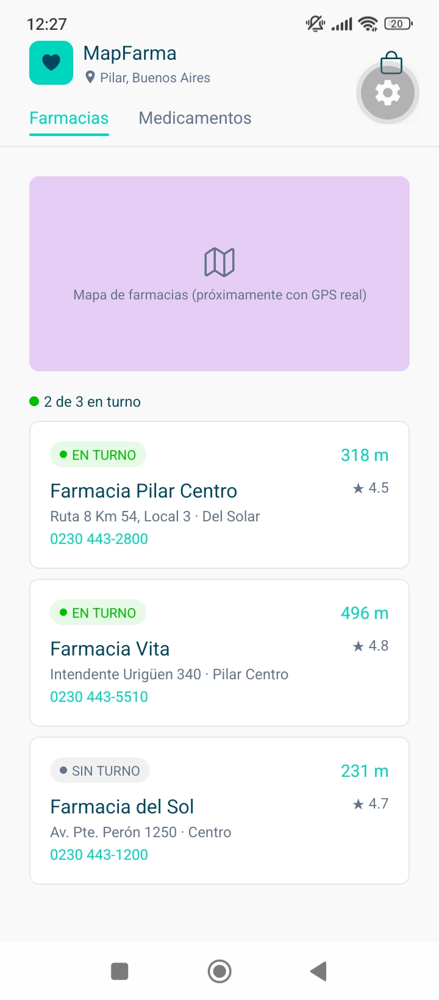

# MapFarma 💊📍

Aplicación móvil que usa geolocalización por GPS para mostrar farmacias de turno en **Pilar, Buenos Aires** en tiempo real, integrada con un carrito de compras digital para encargar medicamentos y retirarlos de forma presencial en el establecimiento seleccionado.



## Integrantes

- Sonny Francisco López Villanueva — Desarrollador
- Luciano Federico Eurolo — Desarrollador
- Facundo Valentín Torrente — Desarrollador
- Francesco Paolo Villarroel Galarza — Desarrollador
- Martín Javier Muñoz Ayala — Desarrollador
- Gustavo Ezequiel Zapata — Desarrollador

## Stack

- [Expo](https://expo.dev) (SDK 57) + React Native
- TypeScript
- Expo Router (navegación por archivos)

## Cómo correr el proyecto

```bash
git clone https://github.com/sonny5134/mapfarma.git
cd mapfarma
npm install --legacy-peer-deps
npx expo start
```

Escaneá el QR con la app **Expo Go** (Android/iOS) para verlo en tu celular.

## Estructura de carpetas

```
mapfarma/
├── app/                 # Pantallas (Expo Router: cada archivo = una ruta)
│   ├── login.tsx
│   ├── registro.tsx
│   └── (tabs)/          # Navegación principal por tabs
│       ├── index.tsx        # Inicio (Farmacias / Medicamentos)
│       ├── publicar.tsx     # Agregar medicamento
│       ├── carrito.tsx      # Carrito de compras
│       └── perfil.tsx       # Perfil del usuario
├── components/          # Componentes reutilizables (cards, botones, etc.)
├── constants/
│   └── theme.ts         # Paleta de colores, tipografía, spacing
├── data/                # Datos de ejemplo (mock) mientras no hay backend
├── types/                # Interfaces y tipos de TypeScript compartidos
└── hooks/               # Custom hooks (ej: useCarrito, useUbicacion)
```

## Funcionalidades principales

- **Geolocalización**: muestra las farmacias de turno más cercanas en un mapa.
- **Catálogo de medicamentos**: búsqueda y filtro por categoría.
- **Carrito de compras**: agregar productos de distintas farmacias, con manejo especial para medicamentos que requieren receta (se pide adjuntar foto antes de confirmar el pedido).
- **Checkout**: elección de método de pago y confirmación de retiro presencial.
- **Perfil**: datos del usuario, productos publicados e historial de pedidos.

## Paleta de colores

| Color          | Hex       | Uso                                          |
| -------------- | --------- | -------------------------------------------- |
| Primario       | `#01475D` | Headers, botones principales, textos fuertes |
| Secundario     | `#00D6BD` | Acentos, badges "en turno", precios          |
| Fondo tarjetas | `#E5CDF5` | Fondo de tarjetas e imágenes de producto     |
| Fondo app      | `#F9F9F9` | Fondo general                                |
| Confirmaciones | `#00BF00` | Estados positivos (en stock, confirmado)     |
| Errores        | `#FF0000` | Errores, sin stock                           |

## Estado actual del proyecto

- [x] Setup de Expo + TypeScript + Expo Router
- [x] Theme (colores, tipografía, spacing)
- [x] Pantalla de Login
- [x] Navegación por tabs
- [x] Pantalla de Registro
- [x] Home con mapa y lista de farmacias
- [x] Catálogo de medicamentos
- [x] Carrito funcional
- [x] Checkout
- [x] Perfil de usuario
- [x] Publicar medicamento
